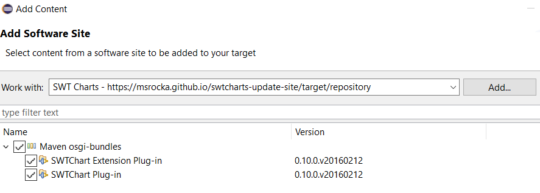

# swtcharts-update-site
This is an Eclipse update site for the [SWT Charts plugins](http://www.swtchart.org/)
so that they can be used in target definitions of an Eclipse platform etc. It
seems that there is currently no update site for these plugins and that they are
also not contained in the central Maven repository.

This repository contains the 0.10.0 version of the SWT Charts plugins. Please
see the [SWT Charts website](http://www.swtchart.org/) or their
[Sourceforge site](https://sourceforge.net/projects/swt-chart/) for official and
newer versions. The SWT Charts plugins are licensed under the
[Eclipse Public License - v 1.0](https://www.eclipse.org/legal/epl-v10.html).
You can find a copy of this license in the file [EPLv1.0.txt](./EPLv1.0.txt).

## Usage
The content of this repository is pushed to the `gh-pages` branch so that it is
hosted as a static site on Github: https://msrocka.github.io/swtcharts-update-site/.
To use it as software/update/p2-repository site in Eclipse, you need to add the
site with the following URL:

```
https://msrocka.github.io/swtcharts-update-site/target/repository
```



## Rebuilding/Updating it
This update site was created with the [p2-maven-plugin](https://github.com/reficio/p2-maven-plugin)
by following [this quick tutorial](https://blog.sandra-parsick.de/2017/09/22/generate-p2-repository-from-maven-artifacts-in-2017/).
First, the SWT Charts plugins need to be installed in your local Maven repository.
The script [bin/install.bat](./bin/install.bat) shows how to do it. Then, you
need to configure the p2-maven-plugin in the `pom.xml` and just run `mvn package`
to create the site under `target/repository`. If you have Python 3 installed
you can quickly test it locally via `python -m http.server <port>`, see also the
[server.bat][./server.bat] script.
